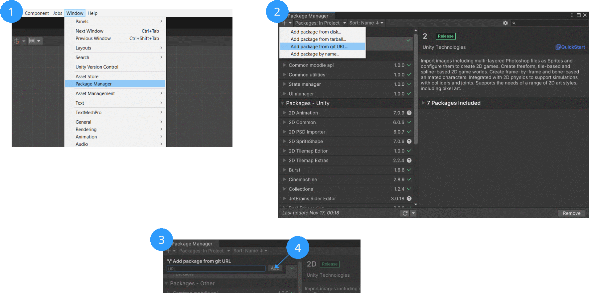
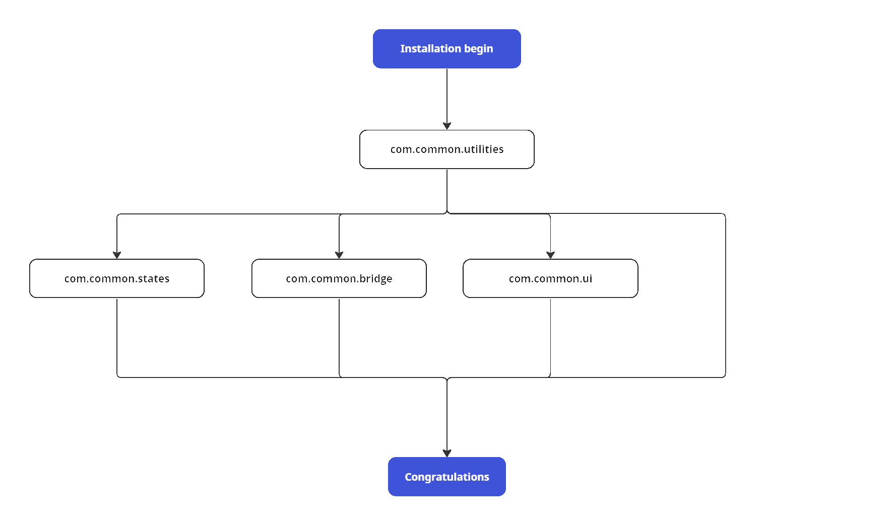

# Установка common пакетов

Для установки пакета требуется использовать ссылку на репозиторий конкретного пакета, а так же токен доступа. 
Формат ссылки: 
```
@git+https://x-oauth-basic:<token>@github.com/tmiwork/<package>.git
```

> [!NOTE]
> На текущий момент для установки доступен следующий список пакетов:
> * **com.common.utilities**
> * **com.common.states**
> * **com.common.bridge**
> * **com.common.ui**

Установка пакета производится через Package Manager, следуя инструкции:

 

или напрямую, добавив пакет в **manifest.json** в формате: 
```
{
  "dependencies": {
    "<package>": "git+https://x-oauth-basic:<token>@github.com/tmiwork/<package>.git,
    ...
```

## Зависимости
Некоторые пакеты содержат зависимости и не могут быть установлены прежде чем будут установлены их зависимости. Порядок установки пакетов отображен в схеме:


